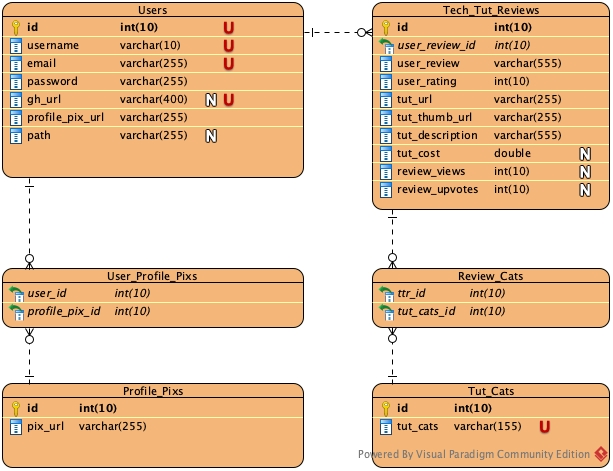

#Tech-Tut-Lister

Tech-Tut-lister is an app that allows programmers to share and promote tech tutorials that best help explain and teach technical subjects. Visitors (non-registered members) can visit the site to gain quick reviews on tutorials or recommendations where to start learning a technical subject. Users (registered members) are given the ability to post links to tutorials while providing their own comments, ratings, and curriculum suggestions.

#### Project by:
Jason Cameron
Yasmine Rico
William Mejia

Initial Project Goals
--- 
- [ ] Ad show page
- [ ] Search
- [ ] Show user's tutorial on their profile page
- [ ] Ensure usernames are unique
- [ ] Clean up the code
- [ ] Dynamic navbar
- [ ] Allow users to update and delete ads
- [ ] Allow users to update their profile information
- [ ] Validate data
- [ ] Error messages
- [ ] Sticky Forms
- [ ] Allow an Ad to have many categories
- [ ] Intended Redirects

DB Design Structure
---

    

